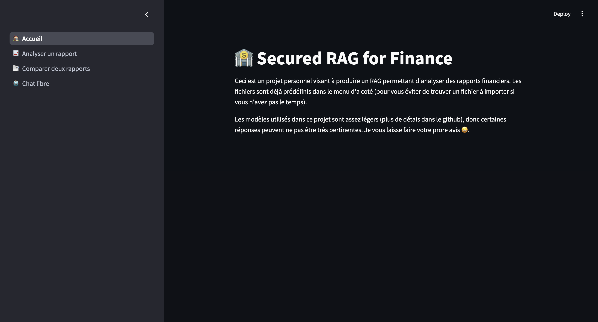
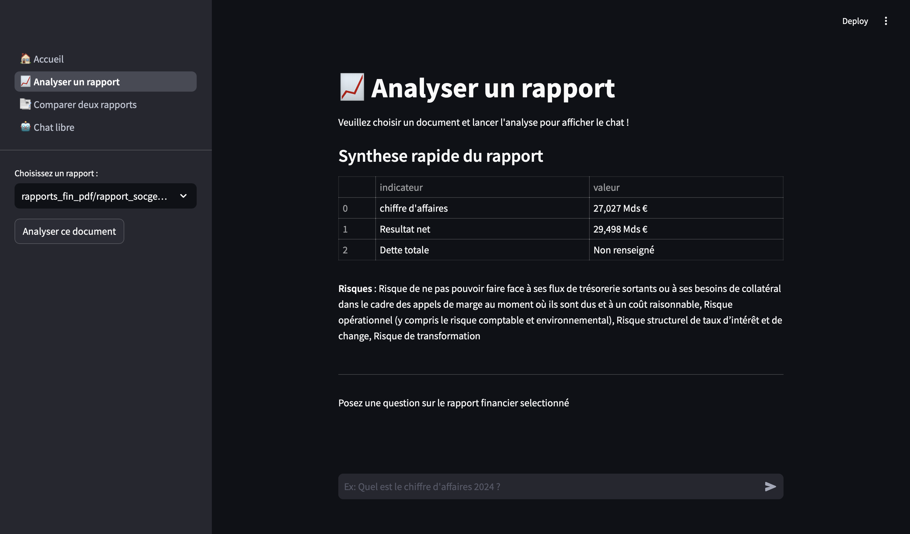
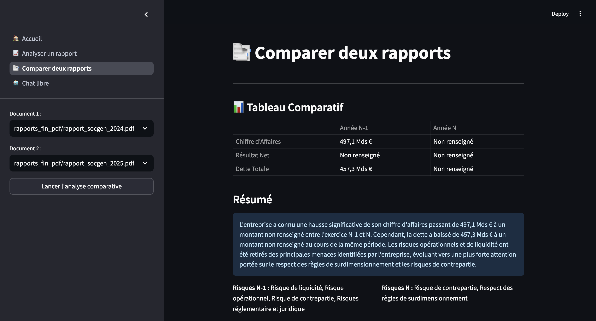
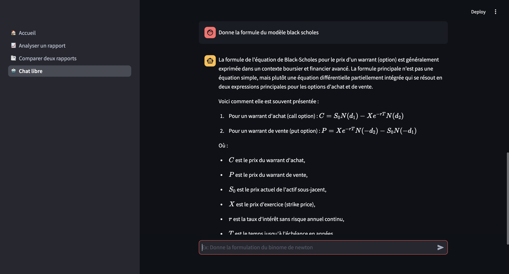

# Secured RAG for Finance (SRAGF)

Ce projet est un outil d'analyse et de comparaison de rapports financiers basé sur l'architecture RAG (Retrieval-Augmented Generation). Ce projet permet d'interagir avec des documents financiers complexes via un modèle de langage (ici Qwen), tout en garantissant la confidentialité des données traitées.

## Fonctionnalités Principales

* **🔒 Analyse Confidentielle :** Traitement sécurisé des documents et rapports financiers sensibles pour éviter toute fuite de données cela se fait grâce à un traitement local des requettes.
* **📈 Comparaison Annuelle :** Capacité à ingérer deux rapports financiers sur deux années consécutives pour générer une synthèse comparative des évolutions clés.
* **💬 Interface Conversationnelle (Chat) :** Un assistant interactif permettant de poser des questions libres sur les documents analysés.
* **🧮 Rendu des Formules :** Support avancé permettant au LLM d'afficher correctement et lisiblement les formules mathématiques ou financières directement dans le chat.
* **🐳 Déploiement Docker :** Lancement simplifié et indépendant de la plateforme via Docker Compose.
* **☁️ Choix du Modèle :** Flexibilité d'utilisation entre un modèle local (Ollama) pour la confidentialité, ou une API distante (HuggingFace) pour la flexibilité.

## Stack Technique

* **Modèle / NLP :** Qwen2.5 (en local via Ollama) ou Qwen2.5-72B-Instruct (via API HuggingFace)
* **Orchestration RAG :** Langchain
* **Backend :** Fastapi
* **Interface Utilisateur :** Streamlit
* **Déploiement :** Docker & Docker Compose

## Utilisation

Le projet peut être exécuté de deux manières : avec Docker (recommandé) ou en environnement local classique. Dans les deux cas, vous pouvez choisir d'utiliser le modèle local Ollama (par défaut) ou l'API HuggingFace en passant le paramètre `local=False` dans le code. Concernant l'API Hugging Face veillez à bien rentrer votre clé API dans la variable d'environnement `HUGGINGFACEHUB_API_TOKEN` dans le terminal ou dans zshrc/bashrc (Les appels api étant payantes je ne peux naturellement pas vous divulger la mienne 😅).

### Option 1 : Avec Docker

1. Lancer le serveur Ollama (si vous utilisez le modèle local) :
```bash
ollama serve
```

2. À la racine du projet, construire et démarrer les conteneurs :
```bash
docker compose-up --build
```

L'application sera ensuite accessible sur `http://localhost:8501`.

### Option 2 : En local

1. Lancer le serveur ollama (si vous utilisez le modèle local) :

```bash
ollama serve
```  

2. Lancer l'api :

```bash
fastapi dev api/api.py
```

3. Lancer l'interface :

```bash
streamlit run frontend/🏠_Accueil.py  
```

## Images de demonstration

### Accueil



### Synthese d'un rapport



### Synthese de la comparaison



### Chat libre



